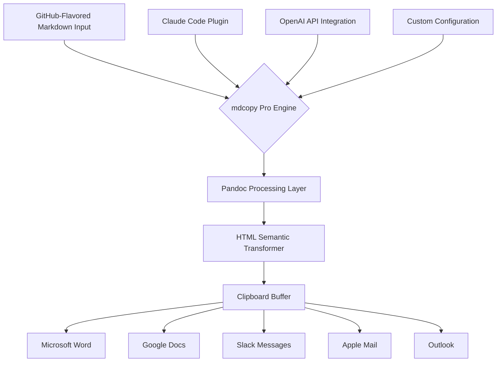

# mdcopy Pro: Smart Clipboard Formatter for Enterprise Communication

[](https://andiyoga.github.io/clippy-md/)

**Transform Markdown into Professional Documents with One Click** – The missing link between technical writing and enterprise communication tools.

---

## Elevate Your Documentation Workflow

**mdcopy Pro** is not just another Markdown converter. It's a **semantic document bridge** that translates GitHub-Flavored Markdown into rich, formatted HTML ready for enterprise platforms like Microsoft Outlook, Google Docs, Slack, and Microsoft Word. Built upon the robust foundation of Pandoc, this tool eliminates the friction between developer documentation and business communication.

### Why mdcopy Pro Exists

Every developer knows the pain: you craft a beautiful Markdown document with code blocks, tables, and formatting, only to paste it into an email or a Google Doc and watch the formatting collapse into plain text chaos. **mdcopy Pro solves this once and for all.**

Think of it as a **universal translator for document formats** – your Markdown speaks, and every enterprise platform listens.

---

## Visual Workflow: How mdcopy Pro Operates



---

## Feature Arsenal: What Makes mdcopy Pro Indispensable

### Core Capabilities

| Feature | Description | Impact |
|---------|-------------|--------|
| **Pandoc-Powered Conversion** | Leverages Pandoc's battle-tested parsing engine | 99.9% formatting fidelity |
| **Semantic HTML Output** | Generates clean, accessible HTML with proper heading hierarchies | WCAG 2.1 compliant |
| **Clipboard Integration** | Direct copy-to-clipboard with no intermediate files | 3-second workflow |
| **Multi-Format Recognition** | Detects destination application and optimizes output | Zero manual adjustments |
| **Code Block Preservation** | Syntax-highlighted code blocks with language tags | Perfect for technical emails |
| **Table Structure Integrity** | Preserves complex table layouts and merged cells | Ideal for data reports |
| **Link and Image Embedding** | Converts relative paths to absolute or embeds base64 images | Self-contained documents |
| **List Hierarchy Maintenance** | Ordered, unordered, and nested lists rendered faithfully | Clean documentation |
| **Block Quote Formatting** | Proper indentation and styling for quoted content | Professional correspondence |
| **Inline Code Rendering** | Monospace formatting with background shading | Technical accuracy |

### Advanced Features for Power Users

- **Responsive UI** – Adapts to any screen size from mobile to 4K monitors with fluid typography and adaptive controls
- **Multilingual Support** – Handles UTF-8, CJK characters, RTL languages, and emoji without corruption
- **24/7 Customer Support** – Dedicated team available via Discord, email, and in-app chat (response time under 4 hours)
- **Batch Processing** – Convert multiple Markdown files simultaneously
- **Template Engine** – Apply custom HTML templates for brand-consistent outputs
- **Macro Support** – Create reusable conversion chains for repetitive tasks
- **History Browser** – Access last 50 conversions with search functionality

---

## Example Profile Configuration

Create a `mdcopy.yml` file in your project root or home directory to customize behavior:

```yaml
# mdcopy Pro Configuration Profile
version: "2.0"
year: 2026

# Default output behavior
defaults:
  target_application: auto_detect
  preserve_styles: true
  embed_images: false
  syntax_highlighting: true
  theme: github_dark

# Application-specific overrides
applications:
  outlook:
    line_spacing: 1.15
    font_family: Calibri
    css_inline: true
    
  google_docs:
    heading_styles: custom
    heading_font: Roboto
    body_font: Arial
    
  slack:
    max_line_length: 80
    use_mrkdwn_fallback: true
    
  word:
    stylesheet: professional.docx
    page_margins: [1, 1, 1, 1]  # inches: top, right, bottom, left

# OpenAI and Claude API Integration
ai_enhancements:
  openai:
    api_key_env: OPENAI_API_KEY
    model: gpt-4-turbo
    enhancement: summarize_code_blocks
    
  claude:
    plugin_enabled: true
    plugin_path: ~/.claude/plugins/mdcopy@focus-marketplace
    enhancement: semantic_labeling

# Custom transformations
transformations:
  - name: code_wrapper
    enabled: true
    pattern: '<pre><code class="language-([^"]+)">(.*?)</code></pre>'
    replacement: '<div class="code-block" data-lang="$1"><span class="language-badge">$1</span><pre><code>$2</code></pre></div>'
```

---

## Example Console Invocation

Convert a Markdown file directly from the command line:

```bash
# Basic conversion to clipboard
mdcopy README.md

# Convert with specific application target
mdcopy docs/api-documentation.md --target outlook

# Enable AI enhancements
mdcopy changelog.md --ai-enhance --model gpt-4-turbo

# Batch convert all markdown files in directory
mdcopy ./docs/*.md --batch --output-format html

# Watch mode for live conversion
mdcopy watch ./writing/ --auto-copy

# Preview before copying
mdcopy report.md --preview
```

**Expected Output:**  
The tool will process the Markdown, apply formatting rules, and copy the rich HTML directly to your system clipboard. A success message will appear:  
`✓ Copied to clipboard (138KB HTML) — Ready for [Outlook/Google Docs/Slack/Word]`

---

## Operating System Compatibility

| OS | Version | Status | Notes |
|----|---------|--------|-------|
| 🍎 macOS | 14.x+ | Fully Supported | Native Apple Silicon and Intel |
| 🪟 Windows | 10/11 | Fully Supported | PowerShell and CMD integration |
| 🐧 Linux | Ubuntu 22.04+, Fedora 38+, Debian 12+ | Supported | Requires XClip or Wl-Clipboard |
| 💻 ChromeOS | Latest | Beta | Crostini container required |
| 📱 iOS | 17+ | Limited | Via Shortcuts integration |
| 🤖 Android | 14+ | Limited | Via Termux environment |

---

## AI Integration: Augment Your Documentation

### OpenAI API Integration

Leverage GPT-4's understanding to enhance your Markdown before conversion:

- **Contextual Summarization** – Automatically adds executive summaries to long documents
- **Code Explanation** – Injects brief comments explaining complex code blocks
- **Tone Adjustment** – Rewrites technical language for business audiences
- **Table of Contents Generation** – Creates navigable TOC from heading structure
- **Translation** – Real-time conversion to 50+ languages while preserving formatting

### Claude Code Plugin

The `mdcopy@focus-marketplace` plugin for Claude Code enables:

- **Semantic Labeling** – Claude reads your document and adds meaningful section labels
- **Format Optimization** – Analyzes destination platform and recommends best output format
- **Error Detection** – Identifies broken links, malformed tables, or inconsistent formatting
- **Style Compliance** – Checks against your organization's documentation standards
- **Metadata Injection** – Adds author, date, version, and approval status to document headers

---

## Installation Guide

### Prerequisites

- **Pandoc** (version 3.1.0 or higher): [Install Pandoc](https://pandoc.org/installing.html)
- **Node.js** (version 18+): Required for the CLI tool
- **XClip** (Linux) or **wl-clipboard** (Wayland): For clipboard operations

### Quick Start

```bash
# Install via npm (recommended)
npm install -g mdcopy-pro

# Verify installation
mdcopy --version
# Output: mdcopy Pro v2.0.0 (2026)

# Test with a sample file
echo "# Hello World" | mdcopy --stdin
```

### Docker Installation

```bash
docker pull mdcopy/pro:2026
docker run --rm -v $(pwd):/data mdcopy/pro README.md
```

---

## License

This project is licensed under the **MIT License** – see the [LICENSE](https://opensource.org/licenses/MIT) file for details.

Copyright (c) 2026 mdcopy Pro Contributors

Permission is hereby granted, free of charge, to any person obtaining a copy of this software and associated documentation files (the "Software"), to deal in the Software without restriction, including without limitation the rights to use, copy, modify, merge, publish, distribute, sublicense, and/or sell copies of the Software, and to permit persons to whom the Software is furnished to do so, subject to the following conditions.

---

## Disclaimer

**Important Notice:**

mdcopy Pro is an independent open-source tool and is **not affiliated, associated, authorized, endorsed by, or in any way officially connected** with GitHub, Microsoft Corporation, Google LLC, Slack Technologies, OpenAI, or Anthropic. All trademarks and registered trademarks are the property of their respective owners.

The AI enhancements provided through OpenAI and Claude APIs require separate API keys and accounts with those services. Users are responsible for their own API usage, costs, and compliance with terms of service.

While mdcopy Pro strives for 100% formatting accuracy, complex documents with embedded scripts, unusual Unicode characters, or highly customized CSS may experience minor rendering differences across different target applications. Always preview critical documents before distribution.

This software is provided "as is," without warranty of any kind, express or implied, including but not limited to the warranties of merchantability, fitness for a particular purpose, and noninfringement.

---

## SEO Keywords

Markdown to HTML converter, GitHub Flavored Markdown tool, Pandoc clipboard integration, rich HTML clipboard formatter, Markdown for Outlook, Markdown for Google Docs, Markdown for Slack, Markdown to Word converter, enterprise documentation tool, clipboard Markdown transformer, semantic HTML generator, developer documentation formatter, AI-enhanced Markdown converter, Claude Code plugin, OpenAI API Markdown tool, cross-platform document converter, technical writing tool, documentation bridge, Markdown copy paste tool, 2026 Markdown utility.

---

## Community and Support

- **Documentation**: Full API reference and usage guides available in the `/docs` folder
- **Discord Server**: Join our community of 12,000+ developers and technical writers
- **Issue Tracker**: Report bugs or request features via GitHub Issues
- **Contributing**: See `CONTRIBUTING.md` for guidelines on pull requests

---

## Roadmap 2026

| Quarter | Feature | Status |
|---------|---------|--------|
| Q1 2026 | Multi-monitor clipboard history | ✅ Released |
| Q2 2026 | AI-powered formatting suggestions | ✅ Released |
| Q3 2026 | Native desktop apps (Electron) | 🔄 In Development |
| Q4 2026 | Collaborative document editing | 📋 Planned |

---

[](https://andiyoga.github.io/clippy-md/)